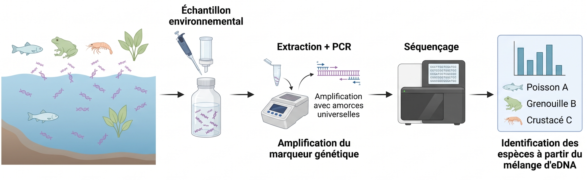
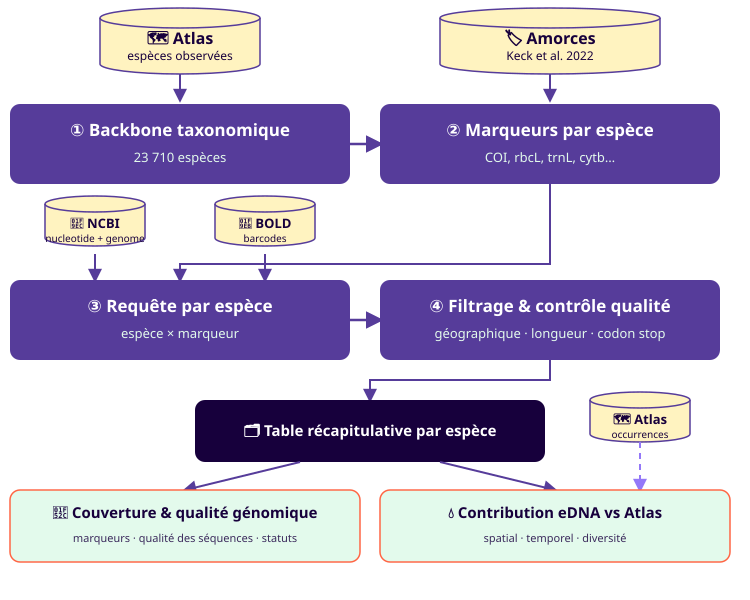
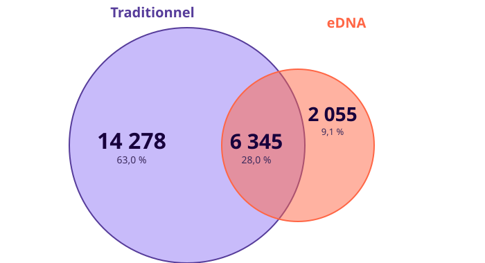
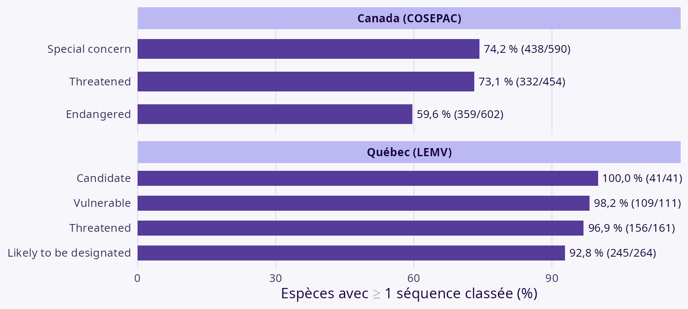
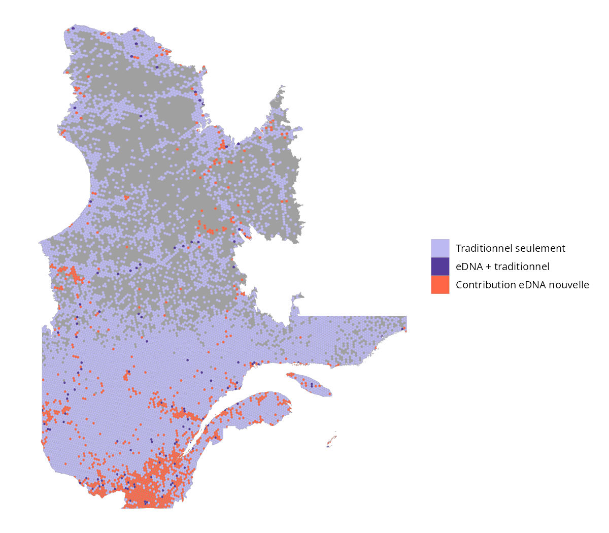
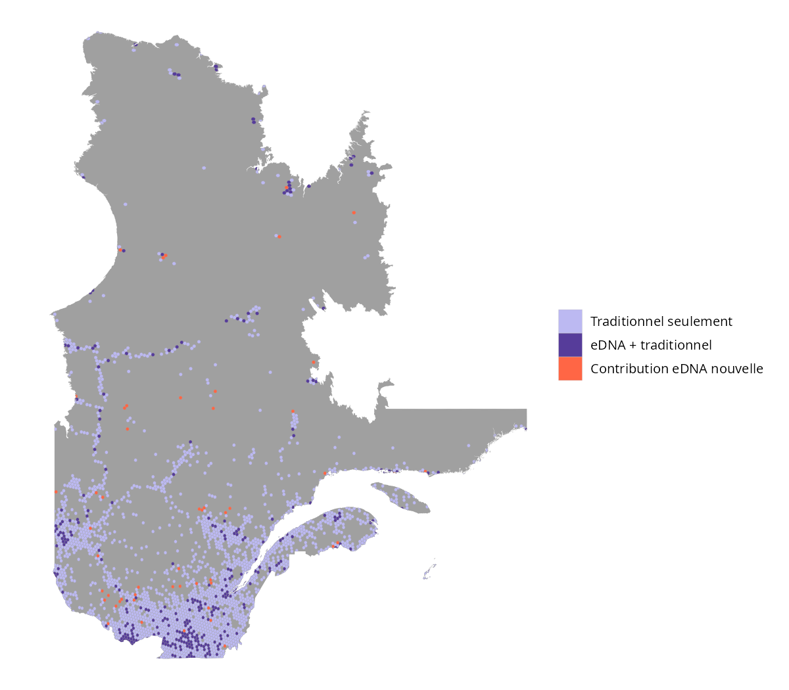
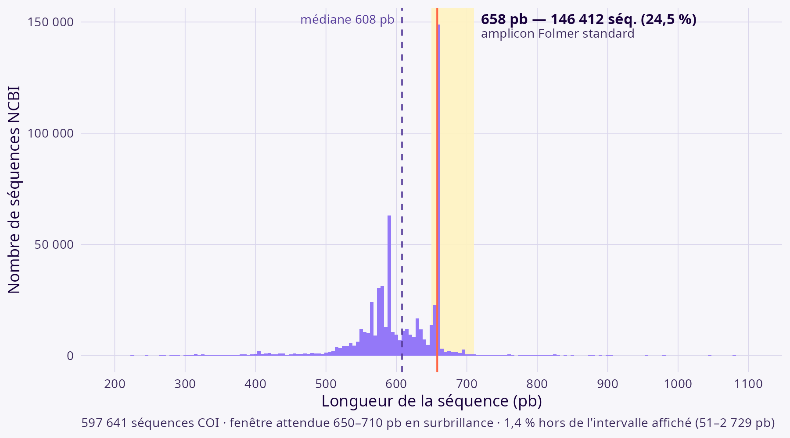

# Introduction {background-color="#17003C"}

## Qu'est-ce que l'ADNe ? {.smaller}

L'ADN environnemental (ADNe) : matériel génétique collecté directement dans l'environnement (eau, sol, air, etc.) sans avoir à capturer ou isoler l'organisme. 

::: {.callout-warning}
Focus sur **Metabarcoding**: détection simultanée de plusieurs taxons à partir d'un marqueur commun *(approche retenue ici)*.
:::

{height="340"}

## Limites des données d'occurences Atlas {.smaller}

**Le problème avec les données d'occurences** : biais spatiaux (nord du Québec) et temporels (saisonnalité). Est-ce que l'ADNe peut venir combler ces lacunes ?

1. Faible coût de collecte comparé aux méthodes traditionnelles.
2. Sensible à la détection des espèces rares ou cryptiques.  

## Questions de recherche {.smaller}

Au Québec : disposons-nous d'une bonne couverture génomique pour les taxons connus, et ces séquences comblent-elles les biais d'échantillonnage traditionnels?

1. Évaluer la complémentarité des séquences ADNe pour compléter les données de biodiversité
2. Déterminer l'ampleur des trous dans les assignations et prioriser le travail de référencement
3. Évaluer la qualité des séquences disponibles pour le suivi de la biodiversité

# Matériel et méthodes {background-color="#17003C"}

## Schéma intégrateur de la méthode {.smaller}

Pipeline reproductible (package R `QCGenomLandscape`, orchestré avec [`targets`](https://books.ropensci.org/targets/))

{fig-alt="Schéma intégrateur de la méthode" width="100%"}

# Résultats {background-color="#17003C"}
La complémentarité du métabarcoding  
avec les inventaires traditionnels au Québec

## Résultats des requêtes {.smaller}

| Indicateur | Valeur |
|---|---:|
| Enregistrements NCBI | 849 850 |
| Enregistrements BOLD | 116 869 |
| Espèces avec génome mitochondrial | 2 634 (11,1 %) |

## Résultats des requêtes {.smaller}

Sur 22 678 espèces d'Atlas couvertes : 6 345 vues par les deux, 2 055 eDNA seulement, 14 278 traditionnel seulement — **28,0 % de similarité**

{height="450"}

## Les 2 055 espèces eDNA seulement {.smaller}

Dans les 1 686 espèces « eDNA seulement » sont principalement des espèces, ça se concentre dans 5 ordres qui font ~97 % du total :

| Ordre | Espèces | % |
|---|---:|---:|
| Diptera (mouches) | 573 | 34,0 % |
| Hymenoptera (guêpes, abeilles, fourmis) | 350 | 20,8 % |
| Lepidoptera (papillons) | 300 | 17,8 % |
| Hemiptera (punaises) | 238 | 14,1 % |
| Coleoptera (coléoptères) | 181 | 10,7 % |
| (6 autres ordres, résiduel) | 44 | 2,6 % |

Ce sont typiquement des groupes riches en espèces, petits/discrets et coûteux à identifier morphologiquement.

## Zoom: Couverture génomiques des espèces à status de conservation {.smaller}

{height="500"}


## Contribution spatiale {.smaller}

::: {.columns}
::: {.column width="50%"}
{height="680"}
:::
::: {.column width="50%"}
{height="680"}
:::
:::

::: {.notes}
Voir Keck, Blackman, Bossart et al. (2022), *Molecular Ecology* 31(6):1820-1835, doi:10.1111/mec.16364. Volet temporel disponible en annexe si question.
:::

# Discussion {background-color="#17003C"}

## Limites de l'ADNe {.smaller}

Notre capacité à inférer la présence d'une espèce est soumise à une propagation de l'erreur: chaque maillon de la chaîne ajoute de l'incertitude.

::: {style="text-align: center;"}
```{mermaid}
%%{init: {'theme':'base', 'themeVariables': {'fontFamily':'Overpass, sans-serif','fontSize':'20px'}, 'flowchart': {'padding':34,'nodeSpacing':55,'rankSpacing':55,'curve':'linear'}}}%%
flowchart LR
    A["`**① Échantillonnage**
    Contamination
    Plan d'échantillonnage`"]
    B["`**② Laboratoire**
    Erreur humaine
    → erreur d'instrument`"]
    C["`**③ Séquençage**
    Prévalence de l'ADNe
    Qualité de l'ADNe`"]
    D["`**④ Assignation**
    Qualité base de référence
    Estimation de l'erreur`"]
    A --> B --> C --> D
```
:::


::: aside
Ficetola, Taberlet &amp; Coissac (2016) [10.1111/1755-0998.12508](https://doi.org/10.1111/1755-0998.12508)
Goldberg et al. (2016) [10.1111/2041-210X.12595](https://doi.org/10.1111/2041-210X.12595)
Keck et al. (2022) [10.1111/1755-0998.13746](https://doi.org/10.1111/1755-0998.13746)
:::

## Comment limiter ces erreurs ? {.smaller}

Notre capacité à inférer la présence d'une espèce est soumise à une propagation de l'erreur: chaque maillon de la chaîne ajoute de l'incertitude.

::: {style="text-align: center;"}
```{mermaid}
%%{init: {'theme':'base', 'themeVariables': {'fontFamily':'Overpass, sans-serif','fontSize':'20px'}, 'flowchart': {'padding':34,'nodeSpacing':55,'rankSpacing':55,'curve':'linear'}}}%%
flowchart LR
    subgraph SG1["Pratiques adaptées"]
        direction LR
        A["`**① Échantillonnage**
        Contamination
        Plan d'échantillonnage`"]
        B["`**② Laboratoire**
        Erreur humaine
        → erreur d'instrument`"]
        C["`**③ Séquençage**
        Prévalence de l'ADNe
        Qualité de l'ADNe`"]
    end
    subgraph SG2["Qualité des données"]
        D["`**④ Assignation**
        Qualité base de référence
        Estimation de l'erreur`"]
    end
    A --> B --> C --> D

    style SG1 fill:none,stroke:#FF6645,stroke-width:3px,stroke-dasharray: 6 4
    style SG2 fill:none,stroke:#FF6645,stroke-width:3px,stroke-dasharray: 6 4
```
:::

## Comment limiter ces erreurs ? {.smaller}

Des organismes dédiés forment aux bonnes pratiques d'échantillonnage, de laboratoire et de séquençage.

::: {style="text-align: center;"}
```{mermaid}
%%{init: {'theme':'base', 'themeVariables': {'fontFamily':'Overpass, sans-serif','fontSize':'20px'}, 'flowchart': {'padding':34,'nodeSpacing':55,'rankSpacing':55,'curve':'linear'}}}%%
flowchart LR
    TAQC@{ img: "assets/logos/taqc_logo.svg", w: 360, h: 228 }
    GENO@{ img: "assets/logos/Genovalia_Logo_Mauve.png", w: 440, h: 166 }

    subgraph SG1["Pratiques adaptées"]
        direction LR
        A["`**① Échantillonnage**
        Contamination
        Plan d'échantillonnage`"]
        B["`**② Laboratoire**
        Erreur humaine
        → erreur d'instrument`"]
        C["`**③ Séquençage**
        Prévalence de l'ADNe
        Qualité de l'ADNe`"]
    end
    subgraph SG2["Qualité des données"]
        D["`**④ Assignation**
        Qualité base de référence
        Estimation de l'erreur`"]
    end
    A --> B --> C --> D

    TAQC ~~~ B
    GENO ~~~ D

    style SG1 fill:none,stroke:#FF6645,stroke-width:3px,stroke-dasharray: 6 4
    style SG2 fill:none,stroke:#FF6645,stroke-width:3px,stroke-dasharray: 6 4
    style TAQC fill:none,stroke:none
    style GENO fill:none,stroke:none
```
:::

## Qualité des séquences de références {.smaller}

Hétérogénéité des longueurs de séquences

{width="100%"}

# Conclusion {background-color="#17003C"}

## Conclusion {.smaller}

- Biais spatial similaire, moins prononcé pour la taxonomie
- Capacité de bonifier des groupes taxonomiques sous-documentés
- Énormément d'hétérogénéité dans la qualité: besoin de standardiser les approches et d'avoir plusieurs marqueurs
- Possibilité d'améliorer la qualité en croisant l'information sur les occurrences avec le séquençage: c'est là tout l'intérêt de croiser les sources de données
- Très mauvaise connaissance de la *dark diversity* : ce qui n'est pas assigné, ou mal assigné. (BOLD résout en partie ce problème)


## Vers une nouvelle plateforme {.smaller}

Design d'une nouvelle plateforme pour intégrer les données d'occurrence et de génomique — avec contrôle de la qualité et harmonisation des sources (BOLD, NCBI, Atlas).

# Merci {background-color="#17003C"}

