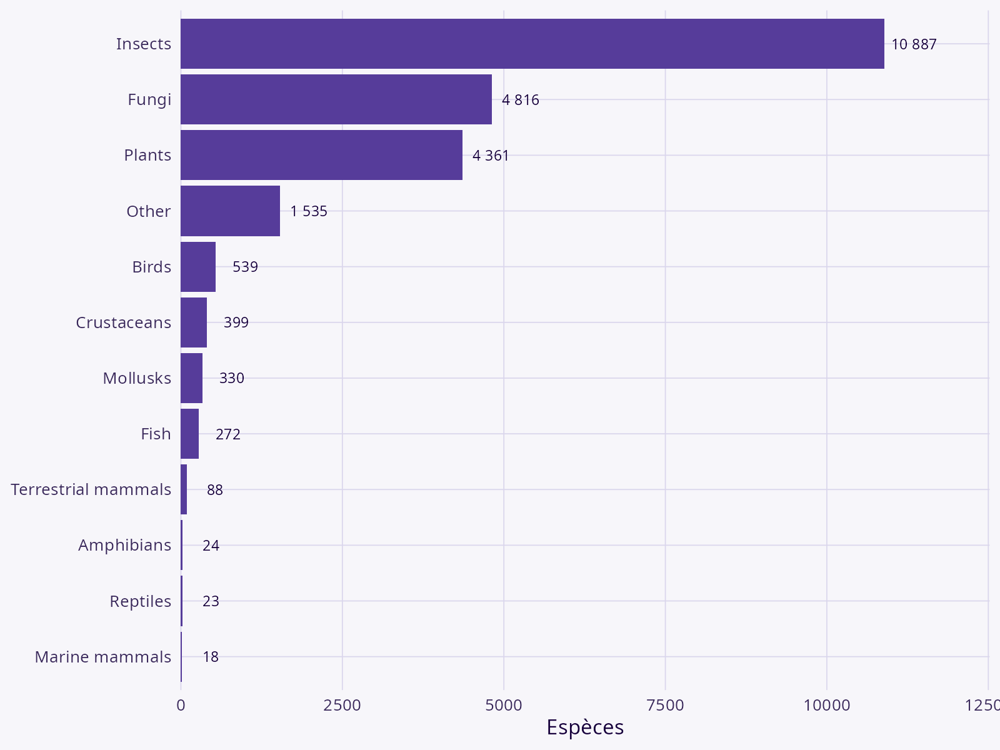
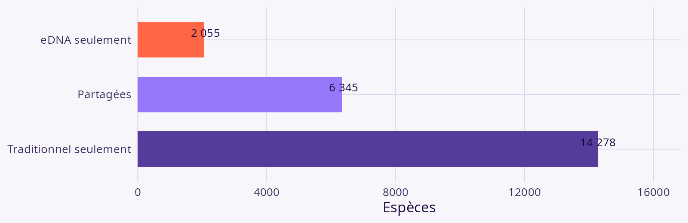

## Résumé {.smaller}

::: {.callout-note}
Slide à compléter — résumé en une diapo une fois les résultats finalisés.
:::

# Introduction {background-color="#17003C"}

## Qu'est-ce que l'ADNe ? Et le problème ? {.smaller}

L'ADN environnemental (ADNe) : matériel génétique collecté directement dans l'environnement (eau, sol, air, etc.) sans avoir à capturer ou isoler l'organisme. **Metabarcoding** — détection simultanée de plusieurs taxons à partir d'un marqueur commun *(approche retenue ici)*.

**Le problème** : répartition inégale des données de biodiversité (occurrence, génétique, interactions, traits) — trous souvent insuffisants pour faire du suivi. L'intégration de l'ADNe aux données d'occurrence est une voie naturelle pour les combler.

## Avantages et limites de l'ADNe {.smaller}

**Avantages** — réduit le fardeau taxonomique, détecte si présent (moins de fausses absences), empreinte spatiale et temporelle accrue.

**Limites** — librairies de référence incomplètes, assignations erronées, biais géographiques, contaminations, imprécision spatiale/temporelle.

La qualité dépend de trois maillons : échantillonnage, laboratoire, **analyse bioinformatique** — c'est ce dernier maillon (qualité des bases de référence) qui porte les librairies incomplètes et les assignations erronées (7 classes de biais documentées, Keck et al. 2022).

## Objectifs {.smaller}

Au Québec : disposons-nous d'une bonne couverture génomique pour les taxons connus, et ces séquences comblent-elles les biais d'échantillonnage traditionnels ?

1. Évaluer la complémentarité des séquences ADN pour compléter les données de biodiversité
2. Déterminer l'ampleur des trous dans les assignations et prioriser le travail de référencement
3. Évaluer la qualité des séquences disponibles pour le suivi de la biodiversité

# Matériel et méthodes {background-color="#17003C"}

## Hypothèses de travail {.smaller}

Deux affirmations à étayer par la littérature :

1. Le choix du pipeline bioinformatique n'influence pas significativement les résultats
2. La qualité des bases de données de référence, elle, les influence significativement

## Approche {.smaller}

Pipeline reproductible (package R `QCGenomLandscape`, orchestré avec [`targets`](https://books.ropensci.org/targets/))

- **BDQC** — liste taxonomique de référence, ~23 700 espèces observées au Québec
- **BOLD Systems** — barcodes ADN (COI principalement), géoréférencés (`geo:province/state:Quebec`)
- **NCBI Nucleotide/Genome** — séquences et génomes assemblés par espèce × marqueur (amorces Keck et al. 2022)
- **COSEPAC / LEMV** — statuts de conservation (Canada / Québec)
- **Atlas de Biodiversité Québec** — occurrences « traditionnelles » (eBird, iNaturalist, relevés, spécimens)

**Attention** : espèces domestiques exclues ; bactéries et protozoaires hors périmètre (couverture eDNA des espèces macroscopiques)

::: aside
Détail complet : `vignettes/approche-methodologique.Rmd`, dépôt `QCGenomLandscape`
:::

## Schéma intégrateur de la méthode {.smaller}

```{=html}
<div style="text-align:center; margin-top: 0.5em;">
<svg viewBox="0 0 1500 400" xmlns="http://www.w3.org/2000/svg" style="width:100%; height:auto; font-family: 'Source Sans 3', sans-serif;">
  <defs>
    <marker id="arrow" viewBox="0 0 10 10" refX="8" refY="5" markerWidth="7" markerHeight="7" orient="auto-start-reverse">
      <path d="M0,0 L10,5 L0,10 z" fill="#563C9A"/>
    </marker>
    <marker id="arrowlight" viewBox="0 0 10 10" refX="8" refY="5" markerWidth="7" markerHeight="7" orient="auto-start-reverse">
      <path d="M0,0 L10,5 L0,10 z" fill="#9478F8"/>
    </marker>
  </defs>

  <!-- ================= SOURCES DE DONNEES (cylindres) ================= -->
  <g fill="#FFF3C0" stroke="#563C9A" stroke-width="1.5">
    <path d="M10,18 a80,10 0 0 1 160,0 v46 a80,10 0 0 1 -160,0 z"/>
    <path d="M190,18 a80,10 0 0 1 160,0 v46 a80,10 0 0 1 -160,0 z"/>
    <path d="M450,18 a110,10 0 0 1 220,0 v46 a110,10 0 0 1 -220,0 z"/>
    <path d="M770,18 a80,10 0 0 1 160,0 v46 a80,10 0 0 1 -160,0 z"/>
    <path d="M950,18 a80,10 0 0 1 160,0 v46 a80,10 0 0 1 -160,0 z"/>
    <path d="M1150,18 a80,10 0 0 1 160,0 v46 a80,10 0 0 1 -160,0 z"/>
    <path d="M1330,18 a80,10 0 0 1 160,0 v46 a80,10 0 0 1 -160,0 z"/>
  </g>
  <!-- arc avant du dessus, pour l'effet cylindre -->
  <g fill="none" stroke="#563C9A" stroke-width="1.5">
    <path d="M10,18 a80,10 0 0 0 160,0"/>
    <path d="M190,18 a80,10 0 0 0 160,0"/>
    <path d="M450,18 a110,10 0 0 0 220,0"/>
    <path d="M770,18 a80,10 0 0 0 160,0"/>
    <path d="M950,18 a80,10 0 0 0 160,0"/>
    <path d="M1150,18 a80,10 0 0 0 160,0"/>
    <path d="M1330,18 a80,10 0 0 0 160,0"/>
  </g>
  <g text-anchor="middle" fill="#17003C">
    <text x="90"   y="44" font-size="16" font-weight="700">📋 BDQC</text>
    <text x="90"   y="60" font-size="12">liste d'espèces</text>
    <text x="270"  y="44" font-size="16" font-weight="700">🗺️ Atlas</text>
    <text x="270"  y="60" font-size="12">espèces observées</text>
    <text x="560"  y="44" font-size="16" font-weight="700">🏷️ Amorces</text>
    <text x="560"  y="60" font-size="12">Keck et al. 2022</text>
    <text x="850"  y="44" font-size="16" font-weight="700">🧬 NCBI</text>
    <text x="850"  y="60" font-size="12">nucleotide + genome</text>
    <text x="1030" y="44" font-size="16" font-weight="700">🧫 BOLD</text>
    <text x="1030" y="60" font-size="12">barcodes</text>
    <text x="1230" y="44" font-size="16" font-weight="700">🛡️ COSEPAC/LEMV</text>
    <text x="1230" y="60" font-size="12">statuts</text>
    <text x="1410" y="44" font-size="16" font-weight="700">📐 CanVec</text>
    <text x="1410" y="60" font-size="12">limites QC</text>
  </g>

  <!-- sources -> etapes -->
  <g stroke="#563C9A" stroke-width="2" marker-end="url(#arrow)">
    <line x1="90"   y1="74" x2="90"   y2="100"/>
    <line x1="270"  y1="74" x2="270"  y2="100"/>
    <line x1="560"  y1="74" x2="560"  y2="100"/>
    <line x1="850"  y1="74" x2="850"  y2="100"/>
    <line x1="1030" y1="74" x2="1030" y2="100"/>
    <line x1="1230" y1="74" x2="1230" y2="100"/>
    <line x1="1410" y1="74" x2="1410" y2="100"/>
  </g>

  <!-- ================= ETAPES DU WORKFLOW ================= -->
  <g>
    <rect x="10"   y="104" width="340" height="80" rx="10" fill="#563C9A"/>
    <rect x="390"  y="104" width="340" height="80" rx="10" fill="#563C9A"/>
    <rect x="770"  y="104" width="340" height="80" rx="10" fill="#563C9A"/>
    <rect x="1150" y="104" width="340" height="80" rx="10" fill="#563C9A"/>
  </g>
  <g text-anchor="middle" fill="#fff">
    <text x="180"  y="136" font-size="17" font-weight="700">① Backbone taxonomique</text>
    <text x="180"  y="162" font-size="13" fill="#E3FAEC">23 710 espèces</text>
    <text x="560"  y="136" font-size="17" font-weight="700">② Marqueurs par espèce</text>
    <text x="560"  y="162" font-size="13" fill="#E3FAEC">COI, rbcL, trnL, cytb…</text>
    <text x="940"  y="136" font-size="17" font-weight="700">③ Requête par espèce</text>
    <text x="940"  y="162" font-size="13" fill="#E3FAEC">espèce × marqueur</text>
    <text x="1320" y="136" font-size="17" font-weight="700">④ Filtrage &amp; contrôle qualité</text>
    <text x="1320" y="162" font-size="13" fill="#E3FAEC">géographique · longueur · codon stop</text>
  </g>
  <g stroke="#563C9A" stroke-width="2.5" marker-end="url(#arrow)">
    <line x1="350"  y1="144" x2="390"  y2="144"/>
    <line x1="730"  y1="144" x2="770"  y2="144"/>
    <line x1="1110" y1="144" x2="1150" y2="144"/>
  </g>

  <!-- ④ -> table (coude) -->
  <polyline points="1320,184 1320,200 750,200 750,218" fill="none"
            stroke="#563C9A" stroke-width="2" marker-end="url(#arrow)"/>

  <!-- ================= SORTIE INTERMEDIAIRE ================= -->
  <rect x="530" y="222" width="440" height="62" rx="10" fill="#17003C"/>
  <text x="750" y="260" text-anchor="middle" font-size="17" font-weight="700" fill="#fff">🗂️ Table récapitulative par espèce</text>

  <!-- Atlas, seconde utilisation : occurrences pour la comparaison -->
  <path d="M1220,232 a80,10 0 0 1 160,0 v42 a80,10 0 0 1 -160,0 z" fill="#FFF3C0" stroke="#563C9A" stroke-width="1.5"/>
  <path d="M1220,232 a80,10 0 0 0 160,0" fill="none" stroke="#563C9A" stroke-width="1.5"/>
  <text x="1300" y="256" text-anchor="middle" font-size="14" font-weight="700" fill="#17003C">🗺️ Atlas</text>
  <text x="1300" y="272" text-anchor="middle" font-size="12" fill="#17003C">occurrences</text>

  <!-- ================= RESULTATS ================= -->
  <g stroke="#563C9A" stroke-width="2" marker-end="url(#arrow)">
    <line x1="640" y1="284" x2="400"  y2="314"/>
    <line x1="860" y1="284" x2="1080" y2="314"/>
  </g>
  <line x1="1300" y1="284" x2="1300" y2="314" stroke="#9478F8" stroke-width="2"
        stroke-dasharray="6 5" marker-end="url(#arrowlight)"/>

  <rect x="90"  y="318" width="580" height="72" rx="10" fill="#E3FAEC" stroke="#FF6645" stroke-width="1.5"/>
  <text x="380" y="346" text-anchor="middle" font-size="17" font-weight="700" fill="#17003C">🔬 Couverture &amp; qualité génomique</text>
  <text x="380" y="370" text-anchor="middle" font-size="13" fill="#3B2A5C">marqueurs · qualité des séquences · statuts</text>

  <rect x="830" y="318" width="580" height="72" rx="10" fill="#E3FAEC" stroke="#FF6645" stroke-width="1.5"/>
  <text x="1120" y="346" text-anchor="middle" font-size="17" font-weight="700" fill="#17003C">💧 Contribution eDNA vs Atlas</text>
  <text x="1120" y="370" text-anchor="middle" font-size="13" fill="#3B2A5C">spatial · temporel · diversité</text>
</svg>
</div>
```

# Résultats {background-color="#17003C"}

## Résultats des requêtes {.smaller}

**Tableau 1 & 2.** Caractéristiques des observations (Atlas) et des séquences (NCBI/BOLD)

| Indicateur | Valeur |
|---|---:|
| Espèces sur la liste BDQC | 23 710 |
| Espèces avec ≥ 1 séquence NCBI | 21 374 (90,1 %) |
| Espèces sans aucune séquence | 2 336 (9,9 %) |
| Enregistrements NCBI (voucher) | 911 819 |
| Enregistrements BOLD | 116 869 |
| Espèces avec génome mitochondrial | 2 634 (11,1 %) |

::: {.callout-note}
Chiffres NCBI restreints à `voucher[Title]` (run en cache) — un prochain `tar_make()` lèvera ce filtre. Résumé Atlas au niveau enregistrement à compléter.
:::

## Résultats des requêtes — composition du backbone {.smaller}

{height="650"}

## O1 · Figure 1a — Taxonomique : recouvrement {.smaller}

Sur 22 678 espèces BDQC couvertes par au moins une approche : 6 345 vues par les deux, 2 055 eDNA seulement, 14 278 traditionnel seulement — **Jaccard = 28,0 %**

{height="450"}

## O1 — Contribution spatiale {.smaller}

::: {.columns}
::: {.column width="50%"}
- Espèces sans aucun enregistrement traditionnel (eDNA seulement) : **2 317 (26,7 %)**
- Paires (espèce, cellule) eDNA non couvertes par l'Atlas traditionnel : **80,1 %**

L'effet varie fortement selon le groupe taxonomique (log-ratio de richesse, Keck et al. 2022 : χ² = 22 118, ddl 11, p < 0,001) — pas un simple déficit uniforme.
:::
::: {.column width="50%"}
{height="500"}
:::
:::

::: {.notes}
Voir Keck, Blackman, Bossart et al. (2022), *Molecular Ecology* 31(6):1820-1835, doi:10.1111/mec.16364. Volet temporel disponible en annexe si question.
:::

## O1 · Tableau 3 — Suivi des espèces menacées {.smaller}

::: {.columns}
::: {.column width="50%"}
| Juridiction | Statut | Espèces | Avec séquence | Couverture |
|---|---|---:|---:|---:|
| Canada (COSEPAC) | Toutes catégories | 1 646 | 1 129 | 68,6 % |
| Canada (COSEPAC) | Endangered | 602 | 359 | 59,6 % |
| Québec (LEMV) | Toutes catégories | 577 | 551 | 95,5 % |
| Québec (LEMV) | Vulnerable | 111 | 109 | 98,2 % |

**Contribution eDNA spécifique** : 61 espèces à statut CA (9,2 %) et 27 QC (22,9 %) détectées uniquement par eDNA — dont *Lamna nasus*, *Thunnus thynnus* (Endangered)
:::
::: {.column width="50%"}
{height="500"}
:::
:::

## O2 · Figure 5 — Profondeur de séquençage par groupe {.smaller}

::: {.columns}
::: {.column width="50%"}
Part des espèces par groupe avec génome complet, 1 seul marqueur, 2, 3 ou 4+ marqueurs distincts, ou sans donnée
:::
::: {.column width="50%"}
{height="500"}
:::
:::

## O3 — Qualité et homogénéité des séquences {.smaller}

::: {.columns}
::: {.column width="50%"}
Un quart des 597 641 séquences COI font **exactement 658 pb** (amplicon Folmer), mais la médiane (608 pb) tombe **sous** cette fenêtre — l'essentiel du dépôt est plus court que le barcode standard.

| Marqueur | n | Médiane (pb) | Codon stop (%) | CV intra-espèce médian |
|---|---:|---:|---:|---:|
| COI | 597 641 | 608 | 4,01 | 6,5 % (homogène) |
| rbcL / matK | 70 607 | 640 | 21,76 | 24,2 % (hétérogène) |
| Nuclear rRNA / ITS | 1 327 606 | 152 | 96,08 | — |

Cas extrême : *Poa trivialis* (trnL, n = 9), longueurs 53–1 766 pb — mini-barcode et intron complet déposés sous la même étiquette.
:::
::: {.column width="50%"}
{height="500"}
:::
:::

# Discussion {background-color="#17003C"}

## Résumé des observations pertinentes {.smaller}

- Ajout significatif d'observations
- Profondeur surprenante de la librairie de référence pour de nombreux groupes, mais souvent 1-2 marqueurs — très variable sur le génome complet
- Biais spatial similaire, moins prononcé pour la taxonomie
- Capacité de bonifier les groupes sous-documentés
- Énormément d'hétérogénéité dans la qualité — besoin de standardiser les approches et d'avoir plusieurs marqueurs
- Possibilité d'améliorer la qualité en croisant l'information sur les occurrences avec le séquençage : c'est là tout l'intérêt de la fusion des sources de données — des synergies sont possibles
- Besoin d'un processus de sélection des séquences pour l'harmonisation BOLD-Distill
- Très mauvaise connaissance de la *dark diversity* : ce qui n'est pas assigné, ou mal assigné

## Enjeux et pistes à venir {.smaller}

- Requêtes taxonomiques et spatiales supposent un BLAST et un géoréférencement corrects — comment interroger ce qui n'est *pas* assigné (dark diversity) ?
- Valorisation des collections : accès à de l'information de qualité en profondeur temporelle, projets inattendus (ex. nématodes)
- Résolution infraspécifique (sous-espèces) : peu de marqueurs la captent — besoin de génomes complets et de qPCR ciblé
- Méthodes à venir : ADN aéroporté, traitement d'image (Medeiros et al. 2025, *NEE*), IA pour l'assignation

## Vers une nouvelle plateforme {.smaller}

Design d'une nouvelle plateforme pour intégrer les données d'occurrence et de génomique — avec contrôle de la qualité et harmonisation des sources (BOLD, NCBI, Atlas) au cœur du design.

# Merci {background-color="#17003C"}

## Contact {.smaller}

Vissault · Fuster · Gravel · Brochu · Langlois
