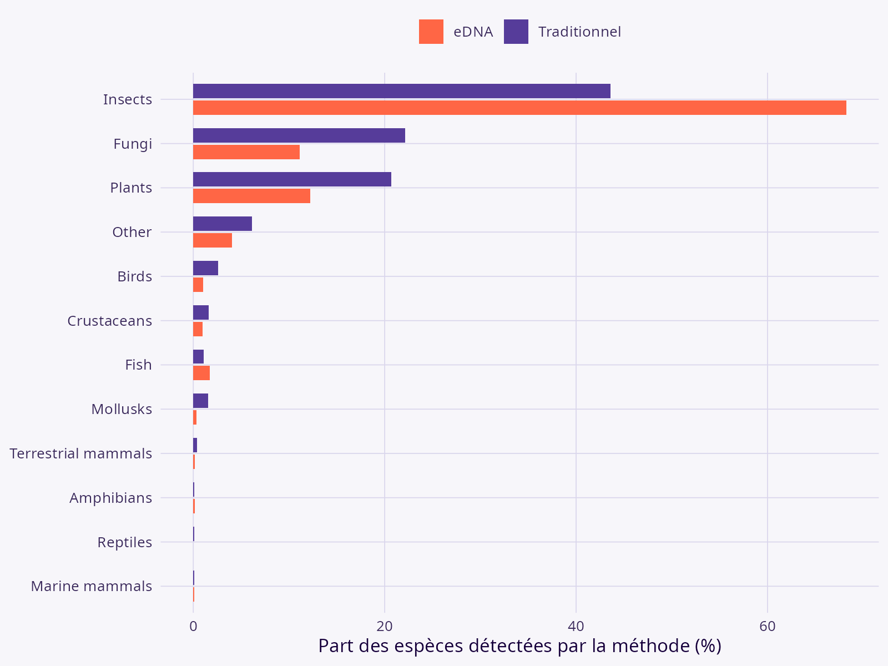
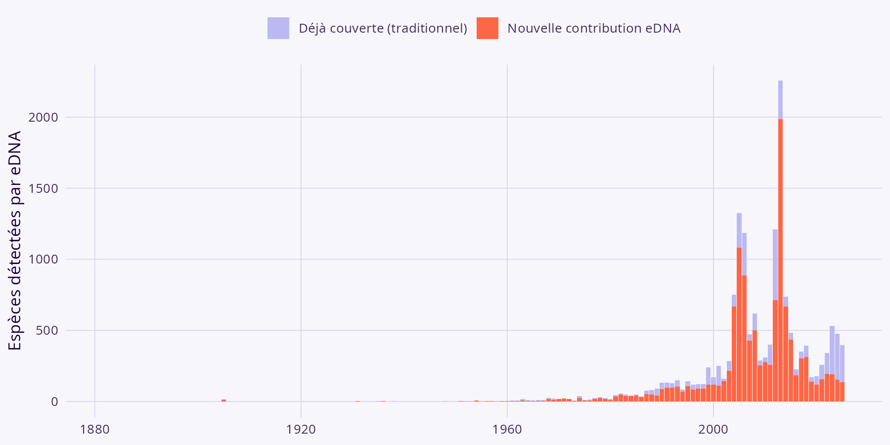
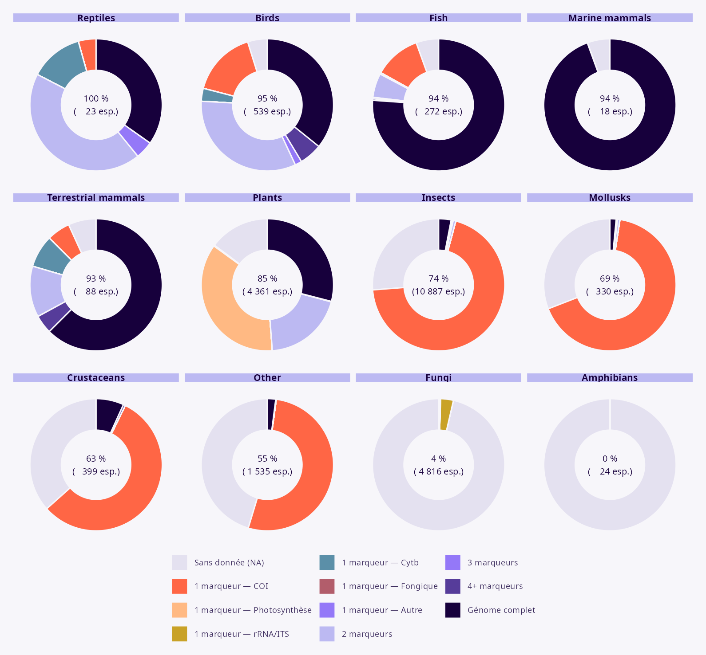
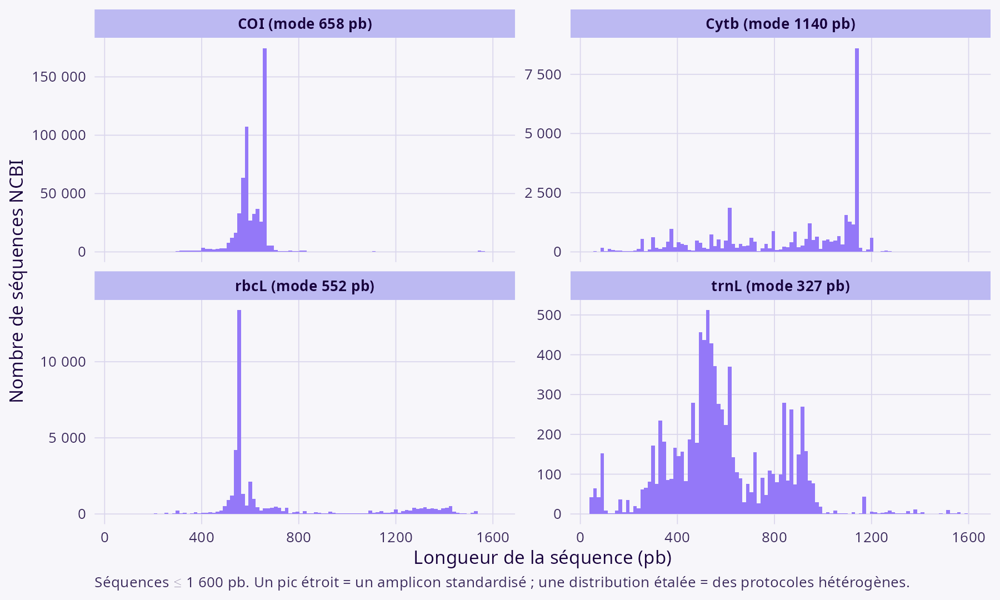

::: {.callout-note}
**Répartition des sections** (à retirer avant soumission)

| Section | Responsable |
|---|---|
| Introduction | AF & DG |
| Matériel et méthodes | SV |
| Résultats (texte) | — (non assigné) |
| Figures & tableaux | SV |
| Discussion | AF & DG |
:::

# Abstract

::: {.callout-note}
À rédiger une fois les résultats finalisés.
:::

# Introduction

::: {.callout-note}
Squelette repris tel quel de l'outline — à rédiger en prose par AF & DG.
:::

**Problème** : répartition inégale des données d'observation de biodiversité, avec des trous et souvent de l'information insuffisante pour faire du suivi.

Biais documentés :

- Occurrence (GBIF — voir intro de Garcia-Rosello 2023 pour citations)
- Génétique
- Interactions (Poisot, Brimacombe)
- Traits

Ces biais sous-tendent une série de *biodiversity shortfalls*.

**L'intégration de données** est vue comme une façon de contourner ces problèmes :

- Données de présence et d'abondance pour les modèles de distribution
- Intégration des données de mouvement pour la cartographie
- Utilisation de données phylogénétiques pour l'imputation de traits
- Combinaison de données génomiques aux données d'occurrence : semble une voie naturelle
- Déjà de nombreuses observations dans GBIF qui viennent de campagnes d'échantillonnage au moyen de l'eDNA

**Avantages potentiels** de l'intégration des données eDNA aux occurrences :

- eDNA : méthodologie distincte pour l'identification
- Réduction du fardeau de l'expertise taxonomique
- Capacité d'échantillonnage accrue (profondeur d'échantillonnage) : si l'animal est présent, il sera détecté (réduit le problème de fausses absences)
- Empreinte spatiale (ex. ruisseau) et temporelle accrue (on évite les enjeux de conditions lors de l'observation)

**Limites** des données ADNe :

- Librairies de référence incomplètes
- Assignations erronées
- Biais géographiques
- Contaminations
- Empreinte géographique (imprécision sur la localisation) et temporelle (imprécision sur la date d'observation)

**Objectifs** :

1. Évaluer la complémentarité des séquences ADN pour compléter les données de biodiversité
2. Déterminer l'ampleur des trous dans les assignations et prioriser le travail de référencement
3. Évaluer la qualité des séquences disponibles pour des fins de suivi de la biodiversité

# Matériel et méthodes

**Attention** : espèces domestiques exclues de l'analyse, ainsi que les conflits liés aux spécimens de musées, herbiers, etc.

## Sources de données

| Source | Contenu | Accès |
|---|---|---|
| BDQC | Liste taxonomique des espèces observées au Québec (~23 710 espèces) | `data/bdqc_list_01122025.csv` |
| Atlas de Biodiversité Québec | Occurrences « traditionnelles » (eBird, iNaturalist, relevés, spécimens…) | téléchargement Parquet |
| BOLD Systems | Barcodes ADN (COI principalement), géoréférencés | API REST |
| NCBI Nucleotide / Genome | Séquences et génomes assemblés par espèce × marqueur | `rentrez` |
| COSEPAC (Canada) / LEMV (Québec) | Statuts de conservation | fichiers officiels |
| Amorces (Keck et al. 2022) | Correspondance marqueur × groupe taxonomique | `data/primers_map_group_bdqc_list_01122025.csv` |
| CanVec 1M | Limites administratives Canada/Québec | ressource CanVec |

## Pipeline

Le pipeline est orchestré avec [`targets`](https://books.ropensci.org/targets/) (package R `QCGenomLandscape`) : chaque étape est mise en cache et n'est ré-exécutée que si son code ou ses entrées changent.

1. **BOLD Systems** — interrogation du portail BOLD pour les enregistrements géoréférencés au Québec.
2. **NCBI — séquences** — pour chaque espèce × marqueur (table de correspondance Keck et al. 2022), construction d'une requête Entrez ; classification `is_voucher` selon la présence d'une mention de spécimen voucher dans le titre.
3. **NCBI — génomes complets** — interrogation des bases `genome` (génomes nucléaires) et `nucleotide` (génomes mitochondriaux complets) par espèce.
4. **Annotations géniques et classification** — annotations GenBank sur un sous-échantillon d'accessions ; classification en marqueur standardisé (COI, Cytb, ND1/2/4/5, 12S/16S rRNA, ITS, marqueurs photosynthétiques).
5. **Statuts de conservation** — normalisation COSEPAC/LEMV, statut le plus sévère conservé par espèce.
6. **Contrôle qualité des séquences** — longueur, %GC, détection de codon stop en phase (COI et gènes codants mitochondriaux), détection d'outliers de longueur (méthode MAD par marqueur).
7. **Variabilité intra-spécifique** — coefficient de variation (CV = SD / médiane × 100) de la longueur des séquences par paire espèce × marqueur (séquences > 10 000 pb exclues : génomes complets/mitogénomes).
8. **Contribution eDNA vs Atlas** — comparaison des occurrences dérivées de l'ADNe (NCBI + BOLD, `extract_edna_occurrences()`) aux occurrences traditionnelles de l'Atlas, sur une grille hexagonale (10 km, `build_hex_grid_cells()`) et par année.
9. **Ampleur de la contribution (log-ratio)** — reprise de la mesure de taille d'effet de Keck, Blackman, Bossart et al. (2022), *Molecular Ecology* 31(6):1820-1835, doi:10.1111/mec.16364 : `ln((richesse eDNA + 0,5) / (richesse traditionnel + 0,5))` par paire (groupe, année) ou (groupe, cellule), modèle mixte linéaire (effet aléatoire = bloc de réplication).

# Résultats

## Résultats des requêtes

**Tableau 1.** Résumé des caractéristiques des observations disponibles sur Atlas

| Indicateur | Valeur |
|---|---:|
| Espèces BDQC avec ≥ 1 détection eDNA (NCBI+BOLD) | 8 664 |
| Espèces avec ≥ 1 occurrence traditionnelle (Atlas) | 20 623 |
| Espèces vues par les deux approches | 6 345 |
| Espèces couvertes par au moins une approche | 22 678 |

::: {.callout-warning}
Décompte au niveau espèce seulement (paires espèce × cellule / espèce × année). Un résumé au niveau enregistrement (nombre total d'occurrences Atlas, nombre de jeux de données, étendue temporelle) reste à produire — nécessite une nouvelle extraction du Parquet Atlas.

Les lignes 2 à 4 sont calculées après exclusion des bactéries et protozoaires et des espèces sans groupe taxonomique BDQC ; sur cette base réduite, l'eDNA couvre 8 400 espèces plutôt que 8 664.
:::

**Tableau 2.** Résumé des caractéristiques des séquences disponibles sur NCBI et BOLD

| Indicateur | Valeur |
|---|---:|
| Espèces sur la liste BDQC | 23 710 |
| Espèces avec ≥ 1 séquence NCBI | 21 374 (90,1 %) |
| Espèces sans aucune séquence | 2 336 (9,9 %) |
| Enregistrements NCBI (voucher) | 911 819 |
| Enregistrements BOLD | 116 869 |
| Espèces avec génome mitochondrial | 2 634 (11,1 %) |

::: {.callout-warning}
Décompte NCBI restreint à `voucher[Title]` (run en cache) — à régénérer sans ce filtre.
:::

## O1 : Complémentarité entre les sources de données

Sommaire des « nouvelles » observations (combinaison espèce-pixel 5 km — ici approximée par une grille hexagonale 10 km).

### Taxonomique

**Figure 1.** Répartition taxonomique des observations directes et des séquences

{width="85%"}

Sur 22 678 espèces BDQC couvertes par au moins une des deux approches : 6 345 vues par les deux, 2 055 uniquement par l'eDNA, 14 278 uniquement par les méthodes traditionnelles — indice de Jaccard = 28,0 %. Khi² d'indépendance (groupe × source) = 1577,4 (ddl 11), p < 0,001 : les profils taxonomiques diffèrent significativement entre les deux approches. Comme chez Keck et al. (2022) : poissons congruents (Jaccard 54 %), groupes moins visibles surtout complémentaires (mollusques 8 %, reptiles 5 %).

**Figure 2.** Nombre d'observations Atlas vs nombre de séquences — permet de documenter si les mêmes biais en faveur des espèces abondantes existent

::: {.callout-note}
Figure à produire — nécessite un croisement espèce × (n occurrences Atlas, n séquences NCBI/BOLD) non encore extrait du pipeline.
:::

### Spatiale

**Figure 3.** Localisation des observations Atlas / Séquences

{width="70%"}

Paires (espèce, cellule) eDNA non couvertes par l'Atlas traditionnel : 80,1 %.

### Temporelle

**Figure 4.** Comparaison des années d'observation Atlas / Séquences

{width="85%"}

Paires (espèce, année) eDNA dans une année sans donnée traditionnelle : 74,0 %.

**Ampleur de l'effet (log-ratio, Keck et al. 2022)** :

| Volet | Log-ratio moyen | IC 95 % | Ratio eDNA/trad. | Effet du groupe |
|---|---:|---:|---:|---:|
| Temporel (bloc = année) | -3,341 | [-3,433 ; -3,248] | 0,04 | χ² = 967,7 (ddl 11), p < 0,001 |
| Spatial (bloc = cellule) | -2,775 | [-2,791 ; -2,759] | 0,06 | χ² = 22 117,8 (ddl 11), p < 0,001 |

### Utilisation pour le suivi d'espèces menacées

**Tableau 3.** Sommaire de la couverture pour les EMV au Québec et au Canada

| Juridiction | Statut | Espèces | Avec séquence | Couverture |
|---|---|---:|---:|---:|
| Canada (COSEPAC) | Toutes catégories | 1 646 | 1 129 | 68,6 % |
| Canada (COSEPAC) | Special concern | 590 | 438 | 74,2 % |
| Canada (COSEPAC) | Threatened | 454 | 332 | 73,1 % |
| Canada (COSEPAC) | Endangered | 602 | 359 | 59,6 % |
| Québec (LEMV) | Toutes catégories | 577 | 551 | 95,5 % |
| Québec (LEMV) | Vulnerable | 111 | 109 | 98,2 % |
| Québec (LEMV) | Threatened | 161 | 156 | 96,9 % |

Contribution eDNA spécifique : 61 espèces à statut CA (9,2 %) et 27 QC (22,9 %) détectées uniquement par eDNA, dont *Lamna nasus* et *Thunnus thynnus* (Endangered).

## O2 : Qualité des données de référence

**Figure 5.** Répartition de la profondeur de séquençage par groupe taxonomique

{width="95%"}

Part des espèces par groupe avec un génome complet séquencé, 1 seul marqueur (rattaché au marqueur), 2, 3 ou 4+ marqueurs distincts, ou sans aucune donnée.

## O3 : Qualité des assignations

**Figure 6.** Localisation des séquences pour différentes espèces

::: {.callout-note}
Figure à produire — carte par espèce (ou petit multiple) des enregistrements NCBI/BOLD géoréférencés ; nécessite de sélectionner un sous-ensemble d'espèces représentatif.
:::

**Tableau 4.** Description des données par marqueur

| Groupes | Marqueurs | Séquences | Espèces | Médiane (pb) | SD (pb) | Q25 (pb) | Q75 (pb) |
|---|---|---:|---:|---:|---:|---:|---:|
| Arthropods | COI, 16S, 18S | 546 815 | 9 638 | 601 | 1 002 | 576 | 658 |
| Fungi | ITS, ITS1, ITS2 | 167 194 | 4 624 | 594 | 14 737 | 526 | 679 |
| Birds / Fish / Mammals / Reptiles | COI, 12S, 16S, cytb | 82 541 | 1 421 | 707 | 1 136 795 | 638 | 1 140 |
| Angiosperms | rbcL, matK, trnL, ITS2 | 74 847 | 4 018 | 728 | 2 418 287 | 552 | 936 |
| Other invertebrates | COI, 18S, 16S | 21 867 | 524 | 627 | 525 | 561 | 657 |
| Bryophytes | rbcL, ITS, trnL, 18S | 5 980 | 574 | 501 | 19 496 | 437 | 636 |
| Conifers / Other plants | rbcL, matK, ITS, trnL | 4 425 | 297 | 617 | 26 407 | 488 | 1 168 |
| Algae | 18S, rbcL, COI | 4 231 | 91 | 664 | 21 741 | 664 | 1 104 |
| Vascular cryptogam | rbcL, matK, trnL, ITS | 2 587 | 178 | 654 | 21 794 | 552 | 1 206 |
| Tunicates | COI, 18S | 1 330 | 9 | 586 | 98 | 524 | 674 |
| Other taxons | 18S, 16S, ITS | 2 | 2 | 37 720 | 1 879 | 37 056 | 38 385 |

::: {.callout-important}
Les écarts-types démesurés (1,1 Mpb chez les vertébrés, 2,4 Mpb chez les angiospermes) ne sont pas des artefacts de mise en forme : les requêtes au niveau du gène (`COI[Gene]`, `rbcL[Gene]`…) retournent aussi des mitogénomes, des génomes chloroplastiques et des chromosomes complets, mélangés aux amplicons de quelques centaines de pb. C'est un résultat en soi — toute statistique de longueur non filtrée sur ces requêtes est ininterprétable, d'où le seuil de 10 000 pb appliqué au calcul du CV intra-spécifique.
:::

**Tableau 5.** Qualité des séquences

| Marqueur | n | Longueur médiane (pb) | Étendue observée (pb) | GC médian (%) | Codon stop (%) | Outliers longueur (%) |
|---|---:|---:|---:|---:|---:|---:|
| COI | 597 641 | 608 | 51–2 729 | 31,9 | 4,01 | 1,90 |
| Photosynthesis-related (rbcL, matK, etc.) | 70 607 | 640 | 50–6 574 | 39,9 | 21,76 | 2,51 |
| Cytb | 36 926 | 948 | 41–2 920 | 43,2 | 21,06 | 0,02 |
| Nuclear rRNA / ITS | 1 327 606 | 152 | 152–2 536 | 45,9 | 96,08 | 10,10 |

**Distribution des longueurs, marqueur par marqueur.** La forme de la distribution des longueurs est en soi un indicateur de standardisation du protocole. Le COI en donne le cas de référence : sur 597 641 séquences, 146 412 (24,5 %) font exactement 658 pb, la longueur de l'amplicon Folmer.

{width="85%"}

La médiane (608 pb) tombe cependant **sous** la fenêtre attendue de 650–710 pb : l'essentiel des dépôts est plus court que le barcode standard, ce qui traduit la coexistence de fragments partiels et de l'amplicon complet. Comparés entre eux, les marqueurs se répartissent entre ceux qui présentent un pic étroit — signature d'un amorçage standardisé (COI, rbcL, Cytb à 1 140 pb pour le gène complet) — et ceux dont la distribution est étalée, signature de protocoles hétérogènes : trnL s'étend du mini-barcode P6 loop (~50 pb) à l'intron complet (~1 500 pb), sans mode dominant (327 pb ne rassemble que 1,6 % des séquences).

{width="85%"}

**Variabilité intra-spécifique des longueurs** (CV = SD / médiane × 100, par paire espèce × marqueur unique ; 18 364 paires) : faible (≤ 10 %) pour 59,7 % des paires, modérée (10–50 %) pour 31,5 %, élevée (> 50 %) pour 8,8 %.

| Marqueur | Paires espèce × marqueur | CV médian (%) | Part > 50 % |
|---|---:|---:|---:|
| COI | 10 093 | 6,5 | 2,0 % |
| rbcL | 3 557 | 24,2 | 26,9 % |
| matK | 2 470 | 11,8 | 6,6 % |
| trnL | 1 221 | 11,9 | 14,2 % |
| Cytb | 790 | 10,6 | 15,1 % |
| 5.8S / LSU / SSU / 18S / ITS2 | 179 | < 1,5 | 0 % |
| RPB1 / RPB2 | 54 | < 3 | 0 % |

Le COI, marqueur le mieux standardisé, est aussi le plus homogène ; les marqueurs plastidiaux le sont beaucoup moins, rbcL en tête. Les CV élevés correspondent à des dépôts hétérogènes sous une même étiquette de marqueur plutôt qu'à une variation biologique : *Poa trivialis* (trnL, n = 9) atteint un CV de 1 076 % avec des longueurs de 53 à 1 766 pb — le mini-barcode P6 loop (~50 pb) et l'intron trnL complet (~1 500 pb) cohabitent sous le même nom de gène. *Lepomis gibbosus* (Cytb, n = 27) présente la même signature : médiane 66 pb, maximum 1 151 pb.

::: {.callout-important}
Le marqueur utilisé pour ce regroupement est celui **annoté sur chaque enregistrement** (`assign_single_marker()`), et non le jeu d'amorces de la requête Entrez. Grouper sur le jeu d'amorces — comme le faisait une version antérieure du pipeline — revient à comparer des marqueurs dont les longueurs attendues diffèrent d'un ordre de grandeur : le CV mesurait alors le mélange de marqueurs et non la qualité des séquences, ce qui surestimait l'hétérogénéité (13,1 % de paires à CV élevé contre 8,8 % après correction).
:::

::: {.callout-note}
`has_stop_codon_coi()` n'est biologiquement pertinent que pour les marqueurs codants (COI, COII, COIII, Cytb, ND1-6, ATP6/8) ; pour les rRNA/ITS et les enregistrements multi-gènes/génome, la colonne « Codon stop » doit être ignorée.
:::

# Discussion

::: {.callout-note}
Squelette repris tel quel de l'outline — à rédiger en prose par AF & DG.
:::

**Résumé des observations pertinentes**

- Ajout significatif d'observations
- Profondeur surprenante de la librairie de référence pour de nombreux groupes, mais souvent 1-2 marqueurs ; très variable sur le génome complet
- Biais spatial similaire, moins prononcé pour la taxonomie
- Capacité de bonifier des groupes qui sont sous-documentés
- Énormément d'hétérogénéité dans la qualité, besoin de standardiser les approches et d'avoir plusieurs marqueurs
- Possibilité d'améliorer la qualité en croisant l'information sur les occurrences avec le séquençage — c'est là tout l'intérêt de la fusion des sources de données, des synergies sont possibles
- Besoin d'un processus de sélection des séquences pour l'harmonisation BOLD-Distill
- Très mauvaise connaissance de la *dark diversity* — ce qui n'est pas assigné, ou mal assigné

**Évaluation de la complémentarité et capacité à bonifier**

**Design d'une nouvelle plateforme** pour intégrer les données d'occurrence et de génomique

**Contrôle de la qualité**

**Enjeux avec les requêtes**

- Requêtes par unité taxonomique : on assume que le BLAST est correct
- Requêtes spatiales (même hypothèse implicite)
- Comment faire les requêtes pour les espèces non assignées pour une région donnée
- Quelle est la qualité des données spatiales
- Problèmes potentiels : ex. spécimens de musées, centroïdes

**Valorisation des collections**

- Accès à une grande quantité d'information de haute qualité pour les bases de référence
- Accès à des observations en profondeur temporelle
- Projets de recherche inattendus (ex. nématodes)

**Dark diversity** : que faire avec les séquences qui ne sont pas assignées ?

**La valeur de l'information spatiale** : ex. assignations contraintes spatialement

**Résolution : le problème des sous-espèces**

- Peu de marqueurs captent cette variation
- Besoin de séquençage du génome complet et de qPCR pour capter cette variabilité

**Nouvelles méthodes à venir**

- Échantillonnage d'ADN aéroporté
- Autres méthodes d'assignation (traitement d'image ADN, Medeiros et al. 2025, *NEE*)
- Intelligence artificielle

# Références

- NCBI : <https://www.ncbi.nlm.nih.gov/>
- BOLD Systems : <https://boldsystems.org/>
- Biodiversité Québec : <https://biodiversite-quebec.ca/>
- CanVec : <https://open.canada.ca/data/en/dataset/306e5004-534b-4110-9feb-58e3a5c3fd97>
- Keck, F., Couton, M., & Altermatt, F. (2022). Navigating the seven challenges of taxonomic reference databases in metabarcoding analyses. *Molecular Ecology Resources*, 23(4), 742-755. doi:10.1111/1755-0998.13746
- Keck, F., Blackman, R.C., Bossart, R., et al. (2022). Meta-analysis shows both congruence and complementarity of DNA and eDNA metabarcoding to traditional methods for biological community assessment. *Molecular Ecology*, 31(6), 1820-1835. doi:10.1111/mec.16364
